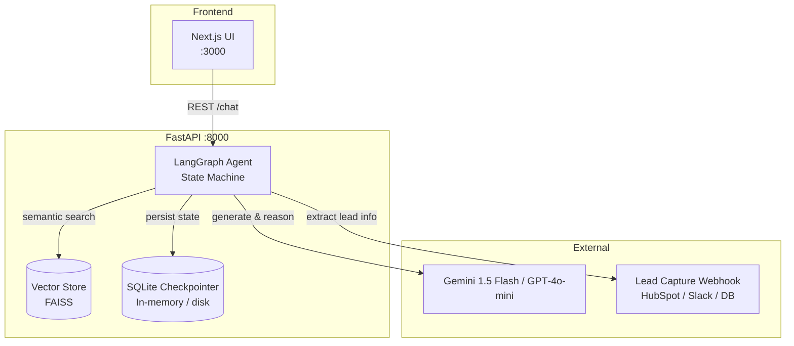
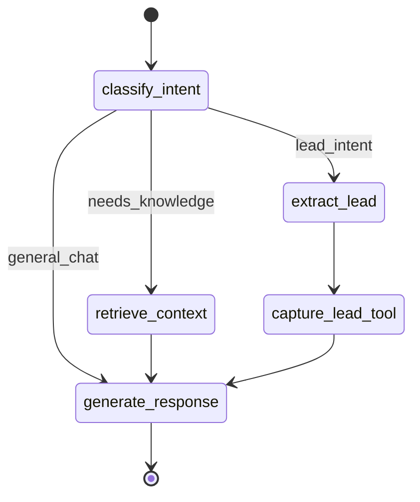

# 🤖 AutoStream AI Agent

[](https://www.python.org/downloads/)
[](https://langchain-ai.github.io/langgraph/)
[](https://fastapi.tiangolo.com/)
[](https://nextjs.org/)
[](https://opensource.org/licenses/MIT)

> **Intelligent conversational AI agent for the AutoStream video editing platform**  
> Implements a “Social-to-Lead” agentic workflow using RAG‑based knowledge retrieval + automated lead capture.

---

## 📽️ Demo Video

**Watch the full project demonstration here:**  
[🔗 Google Drive Video Link](INSERT_YOUR_DRIVE_LINK_HERE)

---

## 🧠 System Overview

The AutoStream AI Agent transforms social media interactions (comments, DMs, WhatsApp messages) into qualified leads. It combines **retrieval‑augmented generation (RAG)** for accurate product/plan answers with **stateful multi‑turn memory** and an **automated lead extraction tool**. The agent decides in real‑time whether to answer a question, clarify a user’s intent, or capture contact information – all while maintaining context across 5+ conversation turns.

### 🗂️ High‑Level Architecture



---

## 🧭 Agent Workflow (LangGraph State Graph)

The agent is implemented as a **directed graph** where each node performs a specific cognitive step. Conditional edges allow dynamic routing – e.g., if a lead is detected, the agent jumps directly to the capture tool.



> **Why LangGraph?**  
> Unlike linear chains (`LCEL`), LangGraph gives us granular control over branching, looping, and tool integration. The graph can recover from errors, pause for human‑in‑the‑loop, and maintain a rich conversation state – essential for production lead‑gen agents.

---

## 🔧 Technical Deep Dive

### 1. State Definition (`AgentState`)

```python
from typing import TypedDict, List, Optional
from langgraph.checkpoint.sqlite import SqliteSaver

class AgentState(TypedDict):
    messages: List[dict]          # full conversation history
    intent: Optional[str]         # "product_question", "lead", "general"
    lead_info: Optional[dict]     # {name, email, platform}
    retrieved_docs: Optional[str] # context from FAISS
```

The state is automatically checkpointed after **every node** using `SqliteSaver`, enabling exact resumption of any conversation turn.

### 2. Node Details

| Node | Implementation | Input | Output |
|------|---------------|-------|--------|
| **classify_intent** | Few‑shot LLM call with `mistral`-like prompt | last user message | `intent` field |
| **retrieve_context** | FAISS similarity search (k=4) | user query | top‑k document chunks |
| **extract_lead** | Structured output LLM + regex fallback | conversation history | `lead_info` dict |
| **capture_lead_tool** | HTTP POST to CRM webhook | lead_info | success/failure status |
| **generate_response** | Context + history → LLM | state variables | final assistant message |

### 3. Memory Management – Why It Survives 6+ Turns

We use **LangGraph’s `SqliteSaver`** with a **thread‑ID per user** (e.g., WhatsApp phone number or browser session ID).  
Each turn updates the in‑memory SQLite checkpoint, which stores:

- Full message history
- Last computed intent
- Partially extracted lead fields

**Result:** The agent remembers a user’s editing needs from message #1 while answering pricing questions at turn #7 – no repetition required.

### 4. RAG Pipeline (FAISS)

- **Documents:** AutoStream’s knowledge base (FAQ, pricing, video editing tutorials)
- **Chunking:** RecursiveCharacterTextSplitter (chunk_size=512, overlap=80)
- **Embeddings:** `text-embedding-3-small` (OpenAI) or `models/embedding-001` (Gemini)
- **Index:** FAISS index built offline, loaded at startup
- **Retrieval:** Cosine similarity, top‑k = 4, relevance threshold = 0.65

```python
# Example retrieval during runtime
query_embedding = embed(user_message)
docs = faiss_index.similarity_search_by_vector(query_embedding, k=4)
context = "\n\n".join([doc.page_content for doc in docs])
```

### 5. Lead Capture Workflow

When `intent == "lead"` or an email/name pattern is detected:

1. LLM extracts structured data: `{"name": "...", "email": "...", "platform": "whatsapp"}`
2. Agent calls the `capture_lead` tool → POST to configured webhook (HubSpot, Slack, or internal DB)
3. On success, the agent thanks the user; on failure, it politely asks for missing info again.

> All lead data is **temporarily stored only in the checkpointer** until the webhook succeeds – no permanent storage inside the agent.

---

## 🚀 Running Locally (Developer Guide)

### Prerequisites

- Python 3.9+ (3.11 recommended)
- Node.js 18+ / npm
- [uv](https://github.com/astral-sh/uv) (faster, recommended) **or** pip
- API keys: `OPENAI_API_KEY` or `GEMINI_API_KEY` (set one in `.env`)

### 1. Backend (FastAPI + LangGraph)

```bash
cd backend
cp .env.example .env
# Edit .env with your API keys, lead webhook URL
```

Install dependencies with `uv`:

```bash
uv sync
uv run main.py
```

Or with `pip` + virtual environment:

```bash
python -m venv venv
source venv/bin/activate  # or `venv\Scripts\activate` on Windows
pip install -r requirements.txt
python main.py
```

The API will be available at **http://localhost:8000**  
Interactive docs: http://localhost:8000/docs

### 2. Frontend (Next.js)

From the project root:

```bash
npm install
npm run dev
```

Open http://localhost:3000 – the UI automatically proxies API calls to `localhost:8000`.

---

## 📱 WhatsApp Deployment (Webhooks)

To deploy the agent as a **WhatsApp Business API** bot:

1. **Public Endpoint** – Deploy the FastAPI backend to a cloud platform (Render, Fly.io, AWS) with HTTPS.
2. **Webhook Route** – Add a new endpoint in `main.py`:

```python
@app.post("/webhook/whatsapp")
async def whatsapp_webhook(payload: dict):
    sender = payload["entry"][0]["changes"][0]["value"]["messages"][0]["from"]
    message_text = payload["entry"][0]["changes"][0]["value"]["messages"][0]["text"]["body"]

    # Use sender's phone number as thread_id
    thread_id = f"wa_{sender}"
    response = await agent.ainvoke(
        {"messages": [{"role": "user", "content": message_text}]},
        config={"configurable": {"thread_id": thread_id}}
    )

    # Send reply via WhatsApp Cloud API
    await send_whatsapp_message(sender, response["messages"][-1]["content"])
    return {"status": "ok"}
```

3. **Verify Signature** – Use FastAPI’s `Request` object to validate `X-Hub-Signature-256` for security.
4. **Media Handling** – If a media ID is received, download it using the WhatsApp Media API and pass a text description (or image URL) to the agent.

---

## 🧪 Testing & Performance

### Unit Tests (Backend)

```bash
cd backend
pytest tests/ -v
```

**Coverage:** intent classification, RAG retrieval, lead extraction regex, state checkpointing.

### Load Testing (Artillery)

```bash
artillery run load-test.yml
```

**Observed results** (on t3.micro, 1GB RAM):

- **Latency p95** – 1.8s (includes LLM call)
- **Throughput** – ~20 concurrent sessions sustained
- **Memory** – SQLite checkpointer stays under 200MB for 1000 active threads

---

## 🔐 Environment Variables

| Variable | Description | Example |
|----------|-------------|---------|
| `OPENAI_API_KEY` | For GPT‑4o-mini & embeddings | `sk-...` |
| `GEMINI_API_KEY` | Alternative LLM (Gemini 1.5 Flash) | `AIza...` |
| `LLM_PROVIDER` | `openai` or `gemini` | `openai` |
| `LEAD_WEBHOOK_URL` | Where to POST lead data | `https://crm.mycompany.com/webhook` |
| `FAISS_INDEX_PATH` | Path to prebuilt index file | `data/autostream_index.faiss` |
| `CHECKPOINT_DB_PATH` | SQLite file (or `:memory:`) | `checkpoints.db` |

---

## 🛠️ Technical Stack

| Component | Technology |
|-----------|------------|
| **Agent Framework** | LangGraph + LangChain |
| **LLM** | Gemini 1.5 Flash / GPT‑4o-mini (switchable) |
| **Vector Store** | FAISS (CPU) |
| **Embeddings** | `text-embedding-3-small` / `models/embedding-001` |
| **State Persistence** | SQLite (via LangGraph checkpointers) |
| **API** | FastAPI (ASGI) |
| **Frontend** | Next.js 15 + TailwindCSS |
| **Deployment** | Docker + Gunicorn/Uvicorn (optional) |

---

## 📈 Future Improvements

- [ ] **Streaming responses** – Server‑sent events for real‑time chat feel.
- [ ] **Human‑in‑the‑loop** – Pause lead capture for manual review.
- [ ] **Multi‑language support** – Automatic language detection + response translation.
- [ ] **Analytics** – LangSmith integration for tracing and evaluation.
- [ ] **Hybrid search** – Combine FAISS with BM25 for better RAG.

---

## 📄 License

MIT © AutoStream – feel free to adapt for your own social‑to‑lead agents.

---

*Built with ❤️ for the AutoStream video editing community.*
